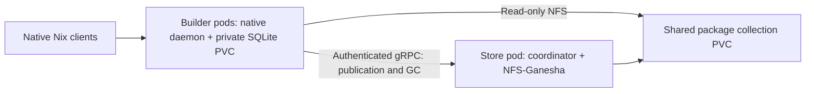

# k8s-distributed-nix-builders

A shared Nix package collection for Kubernetes, with private native Nix databases for each warm builder. Rust coordinates publication and online GC; a C ABI wrapper calls native Nix C++ store operations. Ordinary `nix build` commands run inside builder pods.

## Install with Helm

Build and publish/load the OCI image before installation:

```sh
nix build .#image
# Load result into your cluster's container runtime, or publish it to your registry.
helm upgrade --install nix-builders ./deploy/chart \
  --namespace nix-builders --create-namespace \
  --set image.repository=YOUR_REGISTRY/k8s-distributed-nix-builders \
  --set image.tag=portable \
  --set store.storageClass=YOUR_BLOCK_STORAGE_CLASS \
  --set builders.storageClass=YOUR_BLOCK_STORAGE_CLASS
helm test nix-builders --namespace nix-builders
kubectl exec -n nix-builders -it nix-builders-nix-builder-0 -- nix --version
```

Package the chart with `helm package deploy/chart`. For GitOps, create a Secret containing a 32–256 byte `token` key and set `auth.existingSecret` to its name; otherwise Helm generates and preserves the token on upgrade. Never commit a real token in values files.

The chart creates one store StatefulSet, a three-member warm builder StatefulSet, Services, a NetworkPolicy, and PVCs. CPU and memory requests guide scheduling; there are no resource limits by default. See [values.yaml](deploy/chart/values.yaml).

## Architecture



Each builder retains its own writable store, SQLite database, admission journal, and recovery state. Completed outputs are copied once to the shared collection using native Nix transfer streams over gRPC. Peers register their metadata and bind-mount shared paths into their local store view. SQLite files never live on NFS. Builds execute inside the builder pod; no host Nix installation, host store mount, SSH transport, host daemon, or Kubernetes API access is required.

The store pod serves NFSv4 using userspace Ganesha and coordinates online GC. It never deletes shared files before every configured participant acknowledges safe retirement. Kubernetes Service DNS supplies stable addresses. PVCs survive pod replacement and Helm uninstall. See [ONLINE_GC.md](ONLINE_GC.md) and [ADMISSIONS.md](ADMISSIONS.md).

## Requirements and current boundaries

- Linux x86-64 nodes with kernel NFS client support, privileged pods, and mount namespace support. The image includes the userspace mount helper. This is ordinary Kubernetes, but not compatible with a restricted Pod Security policy.
- RWO PVCs backed by local/block POSIX filesystems such as ext4 or XFS. Ganesha's VFS export requires filesystem file handles; container overlay filesystems and NFS-backed metadata PVCs are unsuitable. Choose storage that fences old writers when moving a PVC.
- Trusted builders and a trusted cluster network. RPC has bearer authentication; TLS is not implemented. The chart restricts incoming RPC/NFS to its pods when the CNI enforces NetworkPolicy. NFS uses AUTH_SYS.
- Pool membership is chosen at installation and recorded on each PVC. Resizing an existing pool is deliberately rejected until a retirement protocol exists. Missing participants prevent GC. Do not force-delete a pod whose old process may still be running.
- Roots acquired through a builder remain pinned for that pod's lifetime. Replacing the pod retires those pins after surviving leases close, while keeping its database and cache. This is conservative, not per-job reclamation.
- A single store pod is a storage availability dependency. Pod replacement recovers its PVC; this is not a highly available NFS service.
- Nix is pinned to **2.33.6** because the C++ integration is version-sensitive. The Helm deployment supplies a builder pool; ARC runner scheduling/job attachment remains an integration concern, not an operator feature.

Conflicting content-addressed realisations remain errors and retain their pending roots. Unrelated outputs continue publishing. The system does not resolve nondeterministic build outputs.

## Build and test

```sh
nix build
nix flake check
nix develop -c cargo test
sudo nix develop -c cargo test --test admissions mounted_paths -- --ignored --nocapture
helm lint deploy/chart
python3 deploy/e2e.py --namespace nix-builders --release nix-builders
```

Native tests cover publication retry, authentication, bounded transfer streams, admission recovery, GC barriers, and real Nix stores. The deployment test uses a disposable Helm installation and exercises native builds, shared reuse, pod replacement, and online collection. Do not run its failure injection against a busy production pool.
